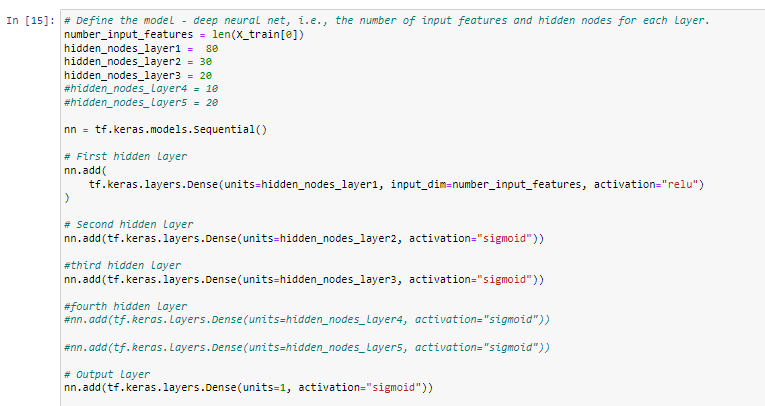
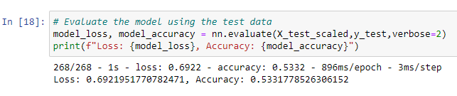
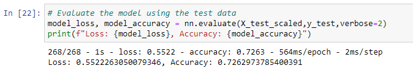

# Neural Network Charity Analysis

## Overview
Over the years, Alphabet Soup has provided funds to 34,000 organizations and has requested the creation of a neural network machine learning model to predict the effectiveness of its contributions. The goal is to use the features provided in the dataset to create a binary classifier capable of predicting whether applicants will be successful if funded by Alphabet Soup.

## Results

### Data Preprocessing
* Our target variable in this model is the IS_SUCCESSFUL column.
* The variables that are the features within this model are AFFILIATION, USE_CASE, INCOME_AMT, ORGANIZATION, APPLICATION_TYPE, CLASSIFICATION, STATUS, ASK_AMT, and SPECIAL_CONSIDERATIONS.
* The variables that should be removed from the input data are the Name and Identification Number (EIN) as they are neither targets nor features.

### Compiling, Training, and Evaluating the Model
* This model contained an input feature and 2 hidden layers with an activation function of "Relu" and "Sigmoid". The first layer had 80 nodes and the second layer had 30.

 

* The ideal target model was not achieved. The goal was 75% or above and 72% was the closest performance reached.

### Optimization 1

### Optimization 2

* In an attempt to increase the model performance, I changed the number of Epoch, the activation type, increased the number of hidden layers, and changed the number of neurons.

## Summary
Upon evaluation of the outcomes of several models, with the inability to attain an accuracy rate above 72%, while also incurring a high percentage of loss, the subsequent models to be explored would be the SVM, a binary classifier, and RandomForrestClassifier.

## Tools
* Jupyter Notebooks
* Pandas
* sklearn
* TensorFlow

